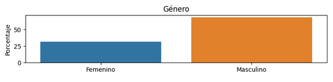
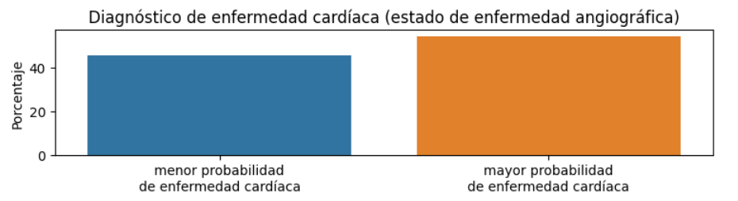

## Predicción de Enfermedad Cardiaca

### Objetivo

El objetivo del presente análisis es desarrollar un modelo de red neuronal que permita predecir si un paciente presenta un cuadro de enfermedad de arterias coronarias.

### Prerequisitos

Las librerias necesarias están listadas en requirements.txt. También se incluye environment.yml para los usuarios de Anaconda.

### Datos

Los datos seleccionados fueron descargados de Kaggle bajo el nombre "Heart Attack Analysis & Prediction Dataset" y fueron subidos por Rashik Rahman. A su vez, la base de datos orginial fue recolectada por: 
1.	Hungarian Institute of Cardiology. Budapest: Andras Janosi, M.D.
2.	University Hospital, Zurich, Switzerland: William Steinbrunn, M.D.
3.	University Hospital, Basel, Switzerland: Matthias Pfisterer, M.D.
4.	V.A. Medical Center, Long Beach and Cleveland Clinic Foundation: Robert Detrano, M.D., Ph.D.

Ver la carpeta de referencias para más información.

### Exploración Inicial de Datos

El conjunto de datos se compone de variables numericas, ordinales y categoricas. La mayoria de los datos proviene de personas por encima de los 40 años y, además, en su mayoria varones.

 

Se puede observar que existe correlación entre ciertas variables numéricas, lo cual sugiere que el modelo se puede beneficiar del uso de regularizacion.

Se puede observar que se tiene una variable objetivo relativamente balanceada. Esto simplifica el desarrollo del modelo.

### Model Building

[Insert information about the model building process here]

### Model Selection

[Insert information about the model selection process here]

### Model Evaluation

[Insert information about the model evaluation process here]

### Model Explanation

[Insert information about the model explanation here]

### Contacto

jimenezc.antn@gmail.com

jimenezc.bo@gmail.com  
